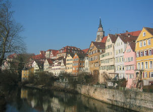
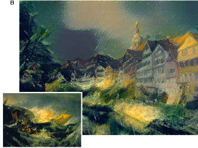

# Generating Art Using Deep Learning (Neural Style Transfer)

Deep learning is the field responsible for self driving cars and facial recognition systems like FaceID on apple devices. In this repo we use deep learning to generate artistic images. A deep convnet is given a content image and a style image and it merges the two preserving content features such as head ,eyes and ears if the content image is a dog image , and preserve the style texture.The style image is usually paintings or ancient art drawings 

 Content Image 

 Style Image 

 Dependencies 

<ul>
  <li>Install Tesnorflow :  pip install tensorflow</li>
  <li>Keras : pip install keras</> 
  <li> numpy: pip install numpy</li>
  <li>scipy: pip install scipy</li>
</ul>

Full turtorial in the jupyter notebook above

Paper Link Below

https://arxiv.org/abs/1508.06576
